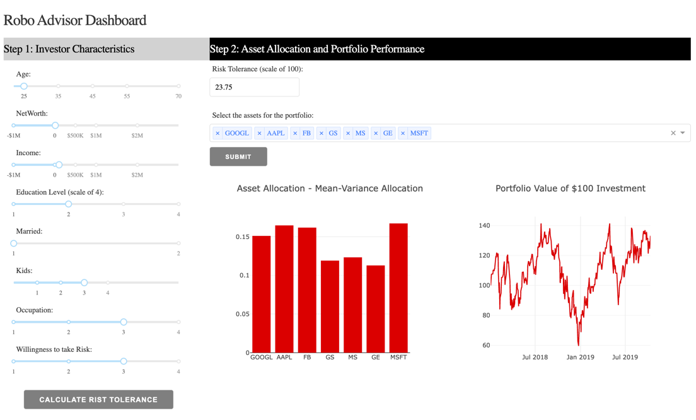

# Machine Learning and Data Science Blueprints for Finance

Personal projects for studying machine learning for finance

[Reference]  
금융 전략을 위한 머신러닝 (Machine Learning and Data Science Blueprints for Finance) | Hariom Tatsat, Sahil Puri, Brad Lookabaugh 지음 | 김한상 옮김 | 한빛미디어 | 2021년 12월 27일 출간

 

## Ch5. Supervised learning - Regression and time series models

#

### Ch5-1. Stock price prediction

**Goal**  
To predict the stock price of Microsoft using correlated assets and its own historical data.

**Predicted variable**  
Weekly return of the Microsoft stock

**Predictor variables**  
Historical data of Microsoft and potentially correlated assets
- Stocks: Microsoft (MSFT), IBM (IBM) and Alphabet (GOOGL)
- Currency: USD/JPY and GBP/USD
- Indices: S&P 500, Dow Jones and VIX

**Summary**  
The time series based ARIMA and LSTM models along with the linear supervised regression models such as LR, LASSO and EN are promising modeling approaches for asset price prediction problem.

#

### Ch5-3. Investor risk tolerance and robo advisor

**Goal**  
To build a ML model to predict the risk tolerance or risk aversion of an investor, and use the model in a robo-advisor dashboard.

**Predicted variable**  
The “true” risk tolerance of an individual

**Predictor variables**  
Demographic, financial and behavioral attributes of an individual

**Data source**  
Survey of consumer finances which is conducted by the Federal Reserve Board
(https://www.federalreserve.gov/econres/scf_2009p.htm)

**Summary**  
We showed that machine learning models might be able to objectively analyze the behavior of different investors in a changing market and attribute these changes to variables involved in determining risk appetite. 

**Dashboard**
